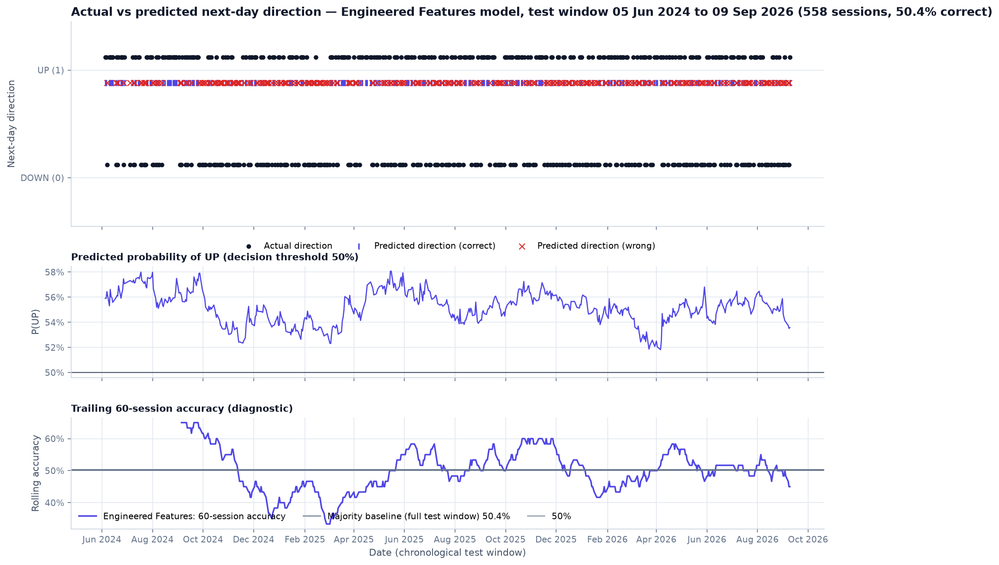

# Stock Price Movement Predictor

*This project is for research and education. It is not investment advice, and nothing here should be used to make financial decisions.*
https://stock-insure2.vercel.app?_vercel_share=6gDPmE7c1ycTfbgeD9O1qMTAok1jbOp

Leak-free next-day **direction** classification for the NIFTY 50 index, with a
web dashboard that renders the executed pipeline's real output.

Track: Time-Series Machine Learning · Stack: Python, pandas, scikit-learn,
matplotlib (analysis) and Next.js + TypeScript (dashboard).

---

## Overview

Given daily Open, High, Low, Close and Volume up to and including trading day
*t*, predict whether the index closes higher on day *t + 1*. The project is
built around one question:

> Do engineered technical indicators improve next-day directional
> classification compared with raw OHLCV features and naive baselines?

The answer on this data is **no**, and the project reports that honestly. What
it does deliver is a methodologically careful pipeline: a leak-free label,
causal features, a chronological split with an embargo, training-only
preprocessing, forward-chaining model selection, and 19 programmatic leakage
and validity checks that all pass.

## Objective

1. Build a leak-free next-day target and leak-free temporal features.
2. Establish two naive baselines: Persistence and Majority Class.
3. Train the same classifier on raw OHLCV, then on raw OHLCV plus engineered
   technical indicators.
4. Evaluate all four approaches once, on the same untouched test window.
5. Report class balance, interpret accuracy relative to it, and plot actual
   against predicted direction.

## Dataset

| Item | Value |
|---|---|
| Instrument | NIFTY 50 index (NSE, India) |
| Ticker | `^NSEI` |
| Source | Yahoo Finance, downloaded with `yfinance` 1.7.0 |
| Frequency | Daily bars |
| Requested window | 2015-01-01 (inclusive) to 2026-09-11 (exclusive) |
| Sessions in the snapshot | 2,879 (2015-01-02 → 2026-09-10) |
| Retrieved | 2026-09-11 19:23 UTC |
| Snapshot | `ml/data/raw/nsei_daily_ohlcv.csv` (+ `.meta.json` with the SHA-256) |

The window ends at the last complete session: Yahoo's bar for 2026-09-11 had no
closing value at retrieval time. The notebook always starts from the committed
snapshot and verifies its checksum, so the numbers below reproduce exactly.
`yfinance` is used only for the download. See [`ml/data/README.md`](ml/data/README.md).

## Problem Formulation

Binary classification, positive class **UP = 1**. The central metric is
directional accuracy, read against the class balance; precision, recall, F1,
balanced accuracy and ROC-AUC are also reported. Regression metrics (RMSE, MAE)
are deliberately absent: this is not a price-prediction task.

## Target Definition

```
Target_t = 1 if Close_(t+1) > Close_t   (UP)
Target_t = 0 otherwise                  (DOWN or unchanged)
```

Implemented in `ml/src/target.py`, the only module that looks forward in time:

```python
next_close = df["Close"].shift(-1)
df["Target"] = np.where(next_close.isna(), np.nan, (next_close > df["Close"]).astype(float))
```

Using tomorrow's close for the **label** is correct; using it in any **feature**
is forbidden. The final session has no next close, so its label is `NaN` and the
row is excluded (the common `(close.shift(-1) > close).astype(int)` shortcut
would silently label it 0). Three sessions in the data close exactly unchanged
and are labelled DOWN.

## Leakage Prevention

| Risk | How it is prevented | How it is verified |
|---|---|---|
| Future values inside a feature | Trailing windows, `adjust=False` EMAs, positive lags only | Truncation test: every feature recomputed on histories cut at *t*, largest difference **0.0** over 40 cut points |
| Look-ahead code slipping in | `features.py` and `baselines.py` contain no negative shift, centred window, backward fill or interpolation | Syntax-tree scan of both modules |
| Label columns used as inputs | `Target`, `Next_Close`, `Next_Date` are never in a feature set | Feature-list check |
| Train/test contamination | Chronological split, plus a one-session **embargo** so no training label is computed from a test-period close | `max(train date) < min(test date)` and `max(training label date) < min(test date)` |
| Preprocessing leakage | `StandardScaler` inside a `Pipeline`, fitted per fold and on the training window only | Scaler's `n_samples_seen_` and means compared with the training statistics |
| Tuning on the test set | `TimeSeriesSplit` folds inside the training window only | Fold indices checked against the training length |
| Baseline leakage | Majority class from training labels; Persistence from `Close_t > Close_(t-1)` | Both recomputed independently |

All 19 checks are exported to `ml/results/leakage_checks.csv` and rendered on the
dashboard's *Data & Leakage* page. The notebook stops with an error if any fails.

## Feature Engineering

Implemented directly in pandas (`ml/src/features.py`); no technical-analysis
package is used.

* **Feature set A — Raw (5):** Open, High, Low, Close, Volume.
* **Feature set B — Engineered (14):** the raw five, plus
  * **7 technical indicators:** SMA 20, EMA 20, RSI 14 (Wilder), MACD,
    MACD signal, MACD histogram, 20-session rolling volatility;
  * **2 derived features:** 5-session return, day-over-day volume change.

Both experiments use exactly the same rows: 33 warm-up sessions (the MACD signal
line needs 34 closes), 53 sessions whose volume features are undefined (the
provider reports zero volume for 28 sessions) and the final unlabelled row are
excluded — leaving **2,792 usable rows**, shared by all four approaches.

## Baselines

| Baseline | Rule |
|---|---|
| **Persistence** | Predict tomorrow's direction as today's: `1[Close_t > Close_(t-1)]` |
| **Majority Class** | Always predict the dominant **training** class (UP, 53.92% of training labels) |

## Modeling Approach

`Pipeline(StandardScaler → LogisticRegression)` for both feature sets, so the
comparison is fair. Only `C` is tuned, over a grid fixed in advance
(0.001 … 100), scored by accuracy with `TimeSeriesSplit(n_splits=5, gap=1)`
inside the training window. Both searches selected **C = 0.001**, the strongest
regularisation in the grid — validation accuracy fell as the models were allowed
to fit the training data more closely.

## Time-Based Evaluation

```
OLD ─────────────────────────────────────────────────────────► NEW
[ TRAIN 2015-02-20 → 2024-06-03 (2,233) ][E][ TEST 2024-06-05 → 2026-09-09 (558) ]
                                          ▲ one-session embargo (2024-06-04)
```

No shuffling, no random split, and the test window is scored exactly once.

## Results

Test window: 2024-06-05 → 2026-09-09, 558 sessions. Positive class UP.

### Four-Way Comparison

| Approach | Accuracy | Precision | Recall | F1 | Balanced acc. | ROC-AUC |
|---|---|---|---|---|---|---|
| **Persistence** | **54.12%** | 54.45% | 54.45% | 0.544 | 54.12% | n/a |
| Majority Class | 50.36% | 50.36% | 100.00% | 0.670 | 50.00% | n/a |
| Raw OHLCV | 50.36% | 50.36% | 100.00% | 0.670 | 50.00% | 0.508 |
| Engineered Features | 50.36% | 50.36% | 100.00% | 0.670 | 50.00% | 0.506 |

Source of truth: [`ml/results/four_way_comparison.csv`](ml/results/four_way_comparison.csv).

### Class Balance

| Split | UP | DOWN | UP % | Assessment |
|---|---|---|---|---|
| Overall (usable) | 1,486 | 1,306 | 53.22% | mildly imbalanced |
| Train | 1,204 | 1,029 | 53.92% | mildly imbalanced |
| Test | 281 | 277 | 50.36% | balanced |

Accuracy must be read against this floor: predicting UP for every test session
already scores 50.36%.

### Visualization



More figures: [four-way comparison](ml/results/four_way_comparison.png),
[confusion matrices](ml/results/confusion_matrices.png),
[class balance](ml/results/class_balance.png),
[train/test split](ml/results/train_test_split.png),
[cross-validation](ml/results/cv_accuracy_by_C.png),
[coefficients](ml/results/engineered_model_coefficients.png).

## Key Findings

1. **Engineered features did not improve on raw OHLCV.** Both models produced
   identical test predictions (0 discordant sessions, exact McNemar p = 1.000).
2. **Both models collapsed to the majority class.** At the selected
   regularisation they predict UP on 100% of test sessions, reproducing the
   Majority baseline exactly, with balanced accuracy 50.00%.
3. **Neither model beat the naive baselines.** Persistence is the most accurate
   approach at 54.12%, 3.76 pp above both models — a difference that is *not*
   statistically significant over 558 sessions (exact McNemar p = 0.229, 277
   discordant sessions).
4. **Probability ranking is essentially random**: ROC-AUC 0.508 (raw) and 0.506
   (engineered), where 0.5 means no ranking skill.
5. **The evidence does not support next-day predictability** of NIFTY 50
   direction from daily OHLCV data and standard technical indicators with a
   linear classifier.

## Limitations

* Financial markets are noisy and non-stationary; next-day direction is close to
  a coin flip and small differences can arise by chance.
* Relationships learned from 2015–2024 can weaken or reverse in a new regime.
* Technical indicators summarise past prices and carry no guarantee of
  predictive power.
* Price-level features (Open/High/Low/Close, SMA, EMA, MACD in points) are
  non-stationary; the test period trades partly outside the training range,
  which a linear model extrapolates poorly.
* One index over one period does not establish generalisation.
* Classification accuracy is **not** trading profitability: costs, slippage and
  position sizing are not modelled, and no trading strategy was evaluated.
* A single chronological hold-out; other windows could differ.
* Yahoo Finance data can be revised; the committed snapshot and its checksum pin
  what was used here.

## Project Structure

```
.
├── app/                      Next.js App Router pages (the dashboard)
│   ├── page.tsx              Overview
│   ├── data/                 Data & leakage verification
│   ├── features/             Feature engineering
│   ├── evaluation/           Model evaluation
│   ├── insights/             Results, findings, limitations
│   ├── methodology/          How to reproduce
│   └── api/                  dashboard.json and artifact downloads
├── components/               UI and chart components (no chart library)
├── lib/                      Data access, types, formatting, chart maths
├── ml/                       The machine-learning project
│   ├── notebooks/stock_price_movement_predictor.ipynb   ← central deliverable
│   ├── src/                  data_loader, target, features, split, baselines,
│   │                         models, evaluation, leakage, plots, dashboard
│   ├── data/raw/             committed snapshot + provenance metadata
│   ├── results/              CSV tables, PNG figures, dashboard.json
│   ├── tests/                pytest invariants for the leakage-sensitive parts
│   ├── run_pipeline.py       executes the notebook and verifies its output
│   └── requirements.txt
└── README.md
```

## Installation

### 1. Analysis (Python 3.11+)

```bash
cd ml
python -m venv .venv
.venv\Scripts\activate          # macOS/Linux: source .venv/bin/activate
pip install -r requirements.txt
```

### 2. Dashboard (Node.js 20.9+)

```bash
pnpm install                     # or npm install
```

## How to Run

```bash
# 1. Run the analysis: executes the notebook and writes ml/results/
cd ml
python run_pipeline.py           # add --refresh to re-download the data window

# 2. Run the tests (optional)
pip install -r requirements-dev.txt
python -m pytest

# 3. Start the dashboard from the repository root
pnpm dev                         # http://localhost:3000
```

Opening the notebook directly works too:

```bash
cd ml
python -m jupyter notebook notebooks/stock_price_movement_predictor.ipynb
```

The dashboard reads `ml/results/dashboard.json` at request time, so re-running
the pipeline is reflected on the next page load — no rebuild required. If the
file is missing, every page shows instructions instead of numbers; nothing is
ever displayed that the pipeline did not produce.

## Reproducibility

* The data snapshot is committed with its retrieval time and SHA-256; the loader
  refuses to run if the file no longer matches its checksum.
* Every experiment setting lives in `ml/src/config.py` (window, split fraction,
  embargo, folds, C grid, random state).
* Logistic regression with `lbfgs` is deterministic; `random_state = 42`.
* `run_pipeline.py` re-executes the notebook end to end, checks that all
  artifacts exist, that every leakage check passed, and that the executive
  summary still quotes the accuracies this run produced.
* Produced with Python 3.12.10, pandas 3.0.5, numpy 2.5.3, scikit-learn 1.9.1,
  matplotlib 3.11.2, yfinance 1.7.0.

## License

[MIT](LICENSE) for the code and documentation. Market data in `ml/data/raw/` is
from Yahoo Finance and remains subject to Yahoo's terms of service.

---
